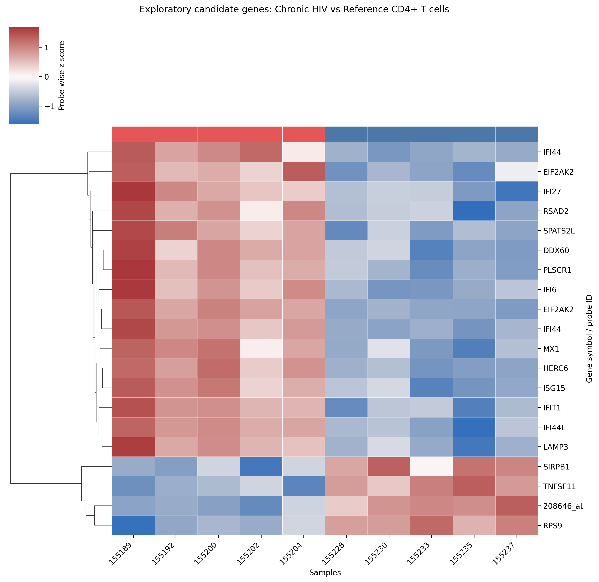

# Chronic HIV CD4+ T-Cell Transcriptomics

Reproducible Python analysis of host transcriptional signatures in purified CD4+ T cells from participants with chronic HIV infection compared with uninfected reference participants.

## Project Overview

This project analyzes public microarray gene-expression data from the Gene Expression Omnibus (GEO) to evaluate transcriptional differences between chronic HIV and uninfected reference CD4+ T-cell samples.

- Dataset: GEO GSE6740
- Platform: Affymetrix Human Genome U133A Array (GPL96)
- Comparison: Chronic HIV CD4+ T cells versus uninfected reference CD4+ T cells
- Analysis environment: Python and Google Colab

## Research Question

Do CD4+ T cells from participants with chronic HIV infection show different gene-expression patterns compared with CD4+ T cells from uninfected reference participants?

## Study Design

| Group | Samples |
|---|---:|
| Chronic HIV CD4+ T cells | 5 |
| Uninfected reference CD4+ T cells | 5 |

## Analysis Workflow

1. Loaded and parsed the GSE6740 GEO series matrix.
2. Identified CD4+ T-cell samples and clinical groups from sample metadata.
3. Selected 5 chronic HIV and 5 uninfected reference samples.
4. Applied log2 transformation: `log2(intensity + 1)`.
5. Assessed sample distributions with boxplot quality control.
6. Filtered probes with low expression.
7. Performed probe-level Welch's two-sample t-tests.
8. Adjusted p-values using the Benjamini-Hochberg false-discovery-rate method.
9. Annotated exploratory candidate probes using the GPL96 platform annotation.
10. Generated a clustered heatmap of candidate-gene expression patterns.

## Results

| Metric | Result |
|---|---:|
| Initial expression matrix | 22,283 probes × 40 samples |
| Final chronic HIV/reference comparison | 22,283 probes × 10 samples |
| Probes retained after filtering | 21,317 |
| Probes significant at FDR < 0.05 | 0 |
| Exploratory candidate probes | 20 |
| Candidate probes mapped to gene symbols | 19 |

No probe met the FDR < 0.05 threshold. An exploratory candidate screen using nominal p < 0.001 and absolute log2 fold change ≥ 1 identified 20 candidate probes.

Candidate expression patterns included IFI44, EIF2AK2, IFI27, RSAD2, DDX60, IFIT1, ISG15, and MX1. These results are exploratory and hypothesis-generating; they require validation in an independent cohort.

## Candidate-Gene Heatmap



**Figure 1.** Clustered heatmap of exploratory candidate probes in chronic HIV versus uninfected reference CD4+ T cells. Each row is standardized across the 10 samples as a probe-wise z-score. Red indicates relatively higher expression and blue indicates relatively lower expression for that probe. The top annotation bar identifies chronic HIV samples in red and reference samples in blue. No probe passed FDR < 0.05; this figure therefore represents hypothesis-generating results.

## Repository Structure

```text
├── data/
│   ├── README.md
│   └── chronic_hiv_vs_reference_exploratory_candidates.csv
├── figures/
│   └── exploratory_candidate_clustered_heatmap.png
├── notebooks/
│   ├── 01_metadata_and_qc.ipynb
│   ├── 02_exploratory_analysis.ipynb
│   └── chronic_hiv_cd4_analysis.ipynb
├── README.md
├── requirements.txt
└── LICENSE
```

## Tools

- Python
- Google Colab
- pandas
- NumPy
- SciPy
- statsmodels
- matplotlib
- seaborn
- requests

## Reproducibility

Open `notebooks/chronic_hiv_cd4_analysis.ipynb` in Google Colab and run the notebook from top to bottom. The workflow reads the public GEO series matrix, retrieves GPL96 annotation data from GEO, and generates the candidate-probe table and heatmap.

## Limitations

The analysis used five samples per group, which limited statistical power. No probe survived multiple-testing correction at FDR < 0.05. Candidate genes should be interpreted as exploratory rather than confirmed differentially expressed genes.

## Data Sources

- [GSE6740: Gene Expression Omnibus](https://www.ncbi.nlm.nih.gov/geo/query/acc.cgi?acc=GSE6740)
- [GPL96: Affymetrix Human Genome U133A Array](https://www.ncbi.nlm.nih.gov/geo/query/acc.cgi?acc=GPL96)

## License

This repository is distributed under the MIT License.
